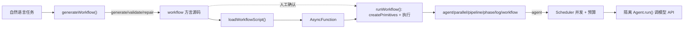

# Agent SDK 动态工作流（Dynamic Workflow）机制设计文档

## 读者指引

- **应用集成者**：若只想在项目里生成 / 执行工作流脚本，请优先阅读 **§1 概述**、**§3 工作流脚本方言**、**§7 对外 API 与 CLI**；面向应用的用法示例见 [`docs/workflow.md`](../workflow.md)。可跳过 **§4 模块设计**、**§5 执行运行时**、**§6 生成链路**、**§9 实现要点**（内部实现）。
- **SDK 贡献者或深度排障**：可通读全文。源码位于 `src/workflow/`，CLI 位于 `src/cli/commands/workflow.ts`。

> 注：按仓库第三方文档政策，面向应用代码的唯一集成面仍是 [`Agent`](../../src/core/agent.ts)。工作流的 `agent()` 原语底层即是隔离的 `Agent` 实例，用户无需直接调用 `ModelAdapter.stream` / `complete`。

---

## 1. 概述

动态工作流机制允许用「一段 JavaScript 方言脚本」编排多个**相互隔离的 `Agent`**，通过 `parallel`、`pipeline`、`phase` 等注入原语表达 fan-out / pipeline / 裁决等并发编排模式。

该机制移植自 ODW（Orchestrated Dynamic Workflow）的双段模型，并把 ODW 中「spawn 外部 CLI（`claude` / `codex`）」的 `agent()` 底座替换为**进程内隔离 `Agent` 调模型 API**。

### 1.1 两段模型

工作流有两个**显式拆分**的阶段，二者互不自动衔接，以保留人工确认的安全边界：

1. **生成段（Generate）**——`generateWorkflow(task)` 用一个「创作 Agent」把自然语言任务写成方言脚本，编译校验，失败则修复（最多 3 次）。
2. **执行段（Execute）**——`runWorkflow(source)` 把脚本编译为 `AsyncFunction`，注入原语后在进程内执行。



### 1.2 核心映射：ODW → agent-sdk

| ODW | 本仓库 |
|-----|--------|
| `agent(prompt)` = spawn 外部 CLI | `agent(prompt)` = 每次起一个隔离 [`Agent`](../../src/core/agent.ts)，`await agent.run(prompt)` 走模型 API |
| `Scheduler` / `Bridge` / `Adapter` / `Runner` 四层 | 坍缩为 `Scheduler` + `Agent`（Agent 内部已封装模型调用与工具循环） |
| 按字符估算预算 | 用 [`AgentResult.usage`](../../src/core/types.ts) 的**真实 token** 记账 |
| detached worker + run 目录持久化 | 第一版简化为进程内 `runWorkflow()`；持久化 / HTTP 留作后续扩展 |

### 1.3 设计目标

- 生成靠 Agent **自由编写 + 方言约束 + 编译校验 + 修复循环**，而非模板填充
- 执行靠**源码变换（`AsyncFunction`）**而非 ESM 模块加载，以支持顶层 `await` / `return` 和注入原语
- 并发是 async（等待 Agent / 模型），并发控制集中在 `Scheduler` 信号量
- 生成与执行**拆成两步**，保留人工确认安全边界

### 1.4 非目标（后续可扩展）

- run 目录持久化、断点续跑、HTTP / detached worker 模式
- 多于一层的工作流嵌套（当前仅支持一层）
- 在脚本内嵌完整沙箱（脚本以 `AsyncFunction` 在当前进程运行，不做隔离）

---

## 2. 模块结构 `src/workflow/`

遵循仓库 barrel 约定（`index.ts` 再导出，`kebab-case.ts` 文件名）：

| 文件 | 职责 |
|------|------|
| `types.ts` | `WorkflowMeta` / `WorkflowPrimitives` / `WorkflowRunContext` / `RunWorkflowOptions` / `AgentPrimitiveOptions` 等类型 |
| `loader.ts` | `loadWorkflowScript(source, filename)`：三步源码变换 + 字符串/注释/正则屏蔽扫描；`scanDualCompat()` 可移植性警告 |
| `scheduler.ts` | `Scheduler`：信号量并发上限 + agent 总数上限 + `gather()` 保序 / `null` 占位 |
| `budget.ts` | `createBudgetTracker()`：基于真实 token 的预算追踪；`tokensFromAgentResult()` |
| `events.ts` | 事件常量、`WorkflowEvent`、`EventSink` / `NullSink` / `MemorySink` |
| `errors.ts` | 错误类型体系与 `isFatalError()` 致命性判定 |
| `primitives.ts` | `createPrimitives(ctx)`：注入原语闭包集合；`createDefaultAgentFactory()` |
| `runner.ts` | `runWorkflow(source, options)`：编译 → 建原语 → 执行 → 返回结果 + 事件流 |
| `generate.ts` | `generateWorkflow(task)` 生成链路；`validateWorkflowSource()` |
| `dialect-doc.ts` | 方言权威文档 `DIALECT_DOC` + 模式摘要 `PATTERNS_DIGEST` + 硬规则 `WORKFLOW_HARD_RULES` |
| `schema-helper.ts` | `formatSchemaInstruction()`（zod→JSON Schema 指令）、`extractJsonFromText()` |
| `parse-script-draft.ts` | 解析创作 Agent 回复为脚本草稿（JSON 优先，回退裸脚本） |
| `index.ts` | barrel 再导出 |

---

## 3. 工作流脚本方言

### 3.1 脚本形态

一段脚本是**纯 JavaScript**，唯一允许的顶层 `export` 是 `meta`，其余原语均由运行时注入（不能 `import`）：

```js
export const meta = {
  name: 'fan-out-reduce',
  description: 'Draft N answers in parallel, then synthesize the best one.',
  phases: [{ title: 'Draft' }, { title: 'Synthesize' }],
}

phase('Draft')
const drafts = await parallel(
  [1, 2, 3].map((i) => () => agent(`Draft #${i}`, { label: `draft-${i}` }))
)

phase('Synthesize')
return await agent('Synthesize from:\n' + drafts.filter(Boolean).join('\n---\n'))
```

### 3.2 硬规则（`WORKFLOW_HARD_RULES`）

这些规则同时用于**生成提示**与**人工编写约定**：

- 脚本必须以 `export const meta = { ... }` 开头，且是**纯对象字面量**（meta 内不得含变量、函数调用、展开、模板串）。
- `meta.name` 短横线命名；`meta.description` 一行；建议声明 `meta.phases`。
- 仅纯 JavaScript——无 TypeScript 注解、无 `import`/`require`、无其它 `export`。
- 只用注入原语：`agent`、`parallel`、`pipeline`、`phase`、`log`、`args`、`budget`、`workflow`、`validate`。
- 禁用 `Date.now()`、`Math.random()`、无参 `new Date()`（不可复现，应通过 `args` 传入）。
- 允许顶层 `await` 与顶层 `return`，最终 `return` 即工作流结果。
- `parallel()` 结果槽位失败时为 `null`，使用前须 `.filter(Boolean)`。

### 3.3 注入原语

| 原语 | 说明 |
|------|------|
| `agent(prompt, opts?)` | 起一个隔离 `Agent` 跑子任务；无 `schema` 返回文本，有 `schema`（zod）返回校验后的结构化对象 |
| `parallel(thunks)` | 并发 fan-out；失败槽位变 `null` |
| `pipeline(items, ...stages)` | 每个 item 一条 async 链、item 间并发，stage 内可再调 `agent()` |
| `phase(title)` | 设置当前阶段并发 `PHASE_STARTED` 事件 |
| `log(message)` | 发 `LOG` 事件 |
| `args` | 调用方注入的运行参数 |
| `budget` | `{ total, spent(), remaining() }` token 预算视图 |
| `workflow(nameOrRef, args?)` | 嵌套子工作流（仅一层），共享 scheduler / budget / 事件 sink |
| `validate(source)` | 仅编译检查，返回 `{ ok, meta, errors, warnings }` |

`agent()` 的 `opts`（`AgentPrimitiveOptions`）：`label`（进度显示）、`phase`（覆盖当前阶段）、`schema`（zod 结构化输出）、`model`（模型 id 覆盖）、`systemPrompt`（系统提示覆盖）、`schemaRetries`（schema 校验重试次数，默认 2）。

---

## 4. Loader：源码变换

`loadWorkflowScript(source, filename)`（`src/workflow/loader.ts`）把方言脚本转成可执行的 `LoadedWorkflow`，分三步：

### 4.1 提取并校验 `meta`

1. 用**屏蔽扫描器** `maskNonCode()` 把字符串 / 模板 / 注释 / 正则字面量替换为空白（保留换行以维持行号），避免误把这些内容里的 `export`/`import` 当成语句。
2. 在屏蔽后的文本里正则定位 `export const meta =`，用花括号配平 `matchBrace()` 找到对象字面量边界。
3. 用 `new Function("return (…)")()` **求值** meta 字面量（因此 meta 必须是纯字面量），再 `assertMeta()` 校验 `name` 为非空字符串、`description` 为字符串。

### 4.2 拒绝额外的 import/export

去掉 `export const meta` 里的 `export` 关键字后，若屏蔽文本中仍出现 `export` 或 `import`，抛 `WorkflowScriptError`——工作流原语是注入的，不允许 import。

### 4.3 包装为 `AsyncFunction`

- 用 `Object.getPrototypeOf(async () => {}).constructor` 拿到 `AsyncFunction` 构造器。
- 形参即注入原语名：`agent, parallel, pipeline, phase, log, args, budget, workflow`，外加可选的 `validate`。
- `validate` 仅在脚本**未自行声明**同名标识符时才注入（`DECLARES_VALIDATE` 检测），避免遮蔽用户变量。
- 追加 `//# sourceURL=<filename>` 便于报错定位。

> 采用源码变换而非 ESM 加载，是为了让脚本支持**顶层 `await` 与顶层 `return`**，并以函数形参形式接收注入原语。

### 4.4 可移植性扫描 `scanDualCompat()`

对 `Date.now()` / `Math.random()` / 无参 `new Date()` 等**能编译但不可复现**的用法产出 `warnings`（不阻断执行），供 `validate()` 与生成校验使用。

---

## 5. 执行运行时

### 5.1 `runWorkflow()` 主流程

`runWorkflow(source, options)`（`src/workflow/runner.ts`）：

1. `loadWorkflowScript()` 编译源码。
2. 建 `EventSink`（默认 `MemorySink`）、`BudgetTracker`、`Scheduler`。
3. 组装 `WorkflowRunContext`（`cwd`/`args`/`currentPhase`/`budgetTotal`/`tokensSpent`/`scheduler`/`sink`/`agentFactory`/`signal`）。
4. `createPrimitives(ctx)` 生成注入原语。
5. 发 `RUN_STARTED` → `loaded.run(primitives, args)` → 成功发 `RUN_FINISHED`、失败发 `RUN_FAILED` 后抛出。
6. 返回 `WorkflowRunResult`：`{ result, meta, events, tokensSpent }`（`events` 仅在使用 `MemorySink` 时非空）。

关键默认值：`maxConcurrency = 4`、`maxAgents = 100`、`budget = null`（无限）。

### 5.2 Scheduler：并发与总量上限

`Scheduler`（`src/workflow/scheduler.ts`）是一个带「失控保护」的有界 async fan-out：

- `runAgent(fn)`：先 `checkpoint()`（检查 abort）→ `budgetGuard()`（检查预算）→ 校验 `dispatchedCount < maxAgents`（否则抛 `AgentLimitExceeded`）→ `acquire()` 抢占并发槽 → 执行 → `finally release()`。
- 信号量用 `waiters` 队列实现：`active < concurrency` 时直接占用，否则入队等待；`release()` 优先唤醒队首等待者。
- `gather(thunks)`：`Promise.allSettled` 后**按输入顺序**返回；`fulfilled` 取值，`rejected` 若为致命错误则记录并最终抛出，否则该槽位置 `null`（可恢复失败占位）。

### 5.3 Budget：真实 token 记账

`createBudgetTracker(total)`（`src/workflow/budget.ts`）：

- `record(tokens)` 累加、`spent()` / `remaining()` 查询、`assertCanDispatch()` 在 `spent >= total` 时抛 `BudgetExhausted`。
- `tokensFromAgentResult(usage)` 优先取 `usage.totalTokens`，否则 `inputTokens + outputTokens`。
- Scheduler 在**每次 dispatch 前**经 `budgetGuard` 检查预算；每次 `agent()` 完成后把 token 累加进 `ctx.tokensSpent`。

### 5.4 原语实现要点（`createPrimitives`）

- **`agent()`**：进 `scheduler.runAgent()` → 发 `AGENT_STARTED` → 经 `agentFactory(opts)` 创建隔离 Agent、`waitForInit()` → `agent.run(composedPrompt, { signal })` → 记账 token → 发 `AGENT_FINISHED` 返回 `result.content`。所有子 Agent prompt 前置 `WORKFLOW_AGENT_PREFIX`，声明「独立作业、勿反问、勿假设其它 agent」。
  - **schema 分支**：`opts.schema` 存在时，最多 `schemaRetries + 1` 次：`extractJsonFromText()` 抽 JSON → `schema.safeParse()`；失败带**上一轮错误反馈**重试；耗尽抛 `SchemaValidationError`。
  - **失败事件**：非致命错误发 `AGENT_FAILED` 后抛出；致命错误（见 §8）直接上抛。
- **`parallel(thunks)`** → `scheduler.gather()`。
- **`pipeline(items, ...stages)`**：每个 item 构造 `previous → stage(previous, item, index)` 的 async 链，链间经 `gather()` 并发。
- **`phase(title)`** 设 `ctx.currentPhase` 并发事件；**`log()`** 发 `LOG` 事件。
- **`budget`** 是对 `ctx` 的只读视图。
- **`workflow(nameOrRef, args?)`**：`depth >= 1` 时抛错（仅一层嵌套）；从 `ctx.cwd` 解析脚本路径、读文件、`loadWorkflowScript()`，用 `phasePrefix` 前缀区分子工作流泳道，**共享**同一 scheduler / budget / sink。
- **`validate(source)`** = `loadWorkflowScript()` + `scanDualCompat()`，捕获异常转为 `errors`。

### 5.5 默认 Agent 工厂

`createDefaultAgentFactory(baseConfig)` 每次 dispatch 造一个新 `Agent`：

- 强制 `loadSkills: false`、`subagent.enabled: false`（工作流自身即编排层，子 Agent 不再派生 subagent）。
- `opts.model` 覆盖：优先改写 `modelConfig.model`；无 `modelConfig` 但有 `model` 适配器时，用 `inferProviderFromAdapter()` 推断 provider 后 `createModel()`。
- `opts.systemPrompt` 覆盖 `config.systemPrompt`。
- 测试 / 高级场景可通过 `options.agentFactory` 完全替换（见 [`docs/workflow.md`](../workflow.md)）。

---

## 6. 生成链路

`generateWorkflow(task, options)`（`src/workflow/generate.ts`）：

1. 建一个「创作 Agent」（系统提示 `AUTHORING_SYSTEM_PROMPT` 要求只回 JSON、`loadSkills: false`、`subagent` 关闭）。
2. **Generate**：authoring prompt = `DIALECT_DOC`（方言文档）+ `PATTERNS_DIGEST`（7 类编排模式摘要）+ 用户任务 + `WORKFLOW_HARD_RULES` + JSON 输出指令（由 `scriptOutputSchema` 经 `formatSchemaInstruction()` 生成）。
3. 回复经 `parseScriptDraft()` 解析为 `{ script, rationale }`——优先按 JSON 解析，失败回退「裸工作流脚本」识别；解析层本身也有最多 3 次重试。
4. **Validate**：`validateWorkflowSource(draft.script)` 仅编译检查（不执行业务）。
5. **Repair**：`ok` 但有 warnings 或直接失败时，回喂「问题列表 + 上一版脚本 + 硬规则」重写，最多 `maxAttempts`（默认 3）次。
6. 终止条件：`ok && 无 warnings` → 立即返回；到最后一次尝试仍只剩 warnings 则容忍返回；否则抛错。
7. 返回 `GenerateWorkflowResult`：`{ script, meta, attempts, rationale }`。

> 生成**不执行业务任务**，`generateWorkflow` 与 `runWorkflow` 是两个显式步骤——对应 ODW「人工确认后再 run」的安全边界。

---

## 7. 对外 API 与 CLI

### 7.1 导出

`src/index.ts` 的 `// Workflow` 段导出 `runWorkflow` / `generateWorkflow` / `validateWorkflowSource` / `loadWorkflowScript` 及相关类型；亦可经子路径 `@ddlqhd/agent-sdk/workflow` 引入。

```typescript
import { generateWorkflow, runWorkflow, validateWorkflowSource } from '@ddlqhd/agent-sdk';

const gen = await generateWorkflow('Research and summarize topic X', {
  modelConfig: { provider: 'openai', model: 'gpt-4o-mini' },
});
const report = validateWorkflowSource(gen.script);   // 仅编译
const run = await runWorkflow(gen.script, {           // 人工确认后执行
  modelConfig: { provider: 'openai', model: 'gpt-4o' },
  args: { topic: 'X' }, maxConcurrency: 4, budget: 100_000,
});
```

### 7.2 CLI（`src/cli/commands/workflow.ts`）

- `agent-sdk workflow generate <task> [-o file] [--json]`：生成并预览脚本，可写文件。
- `agent-sdk workflow run <file> [--args json] [--max-concurrency n] [--max-agents n] [--budget tokens] [--json]`：执行脚本，边执行边打印 phase / agent / log 事件与最终结果。
- 模型选项复用 `addModelOptions` / `modelConfigFromOptions`，与 `chat` / `run` 一致。

---

## 8. 事件与错误

### 8.1 事件（`events.ts`）

`run_started` / `run_finished` / `run_failed` / `run_stopped`、`phase_started`、`log`、`agent_started` / `agent_finished` / `agent_failed`。每个事件带 `ts`（秒级时间戳）与 `type`。`MemorySink` 收集到 `events` 数组，`NullSink` 丢弃。

### 8.2 错误体系（`errors.ts`）

所有工作流错误继承 `DynamicWorkflowError`：

| 错误 | 触发 |
|------|------|
| `WorkflowScriptError` | 脚本畸形（bad meta、语法错误、非法 import/export、嵌套过深等） |
| `AgentLimitExceeded` | 达到 `maxAgents` 总量上限 |
| `BudgetExhausted` | 达到 token 预算 |
| `RunStopped` | 收到 abort 信号，在下个安全点退栈 |
| `SchemaValidationError` | Agent 多次仍未产出符合 schema 的输出 |

`isFatalError()` 判定 `AgentLimitExceeded` / `RunStopped` / `BudgetExhausted` 为**致命**——这类错误必须穿透 `parallel` / `pipeline`，而不能降级为 `null` 槽位。

---

## 9. 实现要点与关键取舍

- **屏蔽扫描器是安全基石**：`maskNonCode()` / `maskForDualScan()` 完整处理字符串、模板串（含 `${}` 插值嵌套）、行 / 块注释、正则字面量，`regexAllowed()` 依据前一个有效字符判定 `/` 是除号还是正则起始。没有它，meta 提取和 import 检测都会被字符串内容误导。
- **meta 用 `new Function` 求值**决定了 meta 必须是纯字面量——换来的是无需引入 JS 解析器即可安全取出结构化元数据。
- **并发集中在 Scheduler**：原语层不各自管并发，`agent()` 一律经 `runAgent()`、fan-out 一律经 `gather()`，预算与总量护栏因此只需在一处布防。
- **隔离 Agent 关闭 skills / subagent**：工作流自身即编排层，子 Agent 只做单点子任务，避免递归派生放大成本。
- **生成与执行解耦**：两个独立函数，生成产物需人工确认再执行，杜绝「生成即运行」的失控风险。

---

## 10. 相关文档与源码

- 应用向用法：[`docs/workflow.md`](../workflow.md)
- 示例脚本：[`examples/workflows/fan-out-reduce.js`](../../examples/workflows/fan-out-reduce.js)
- 单元测试：`tests/unit/workflow-loader.test.ts`、`tests/unit/workflow-scheduler.test.ts`、`tests/unit/workflow-runner.test.ts`
- 源码：`src/workflow/`、CLI `src/cli/commands/workflow.ts`
- 集成面约束：[`docs/sdk-overview.md`](../sdk-overview.md) §3（`Agent` 为唯一支持的应用集成面）
