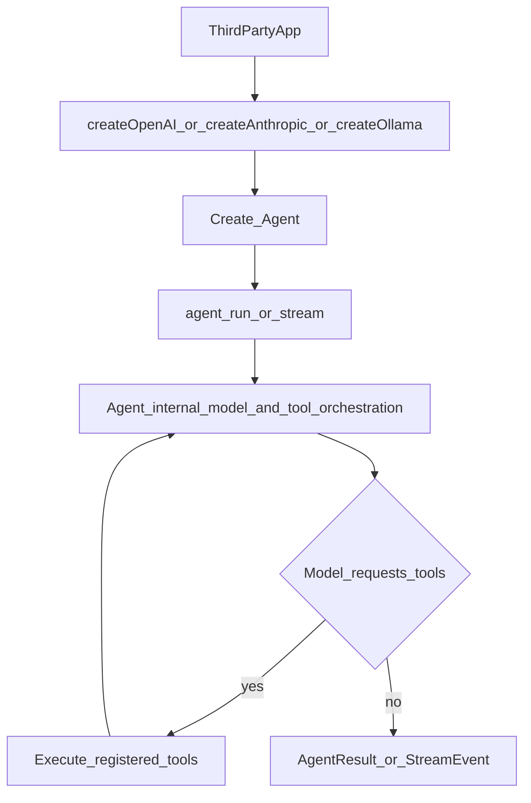

# Agent SDK 第三方集成总览

## 1. 文档目标

本文档集面向第三方开发者，提供 `@ddlqhd/agent-sdk` 的稳定公开能力说明，包括：

- 包入口与版本约束
- 核心对象和调用流程
- 公开 API 与类型参考
- 典型集成方案与排障建议

## 2. 稳定导出边界

`@ddlqhd/agent-sdk` 目前只承诺以下 3 个包入口：

- `@ddlqhd/agent-sdk`
- `@ddlqhd/agent-sdk/models`
- `@ddlqhd/agent-sdk/tools`

请勿直接依赖 `src/**` 深层路径（即使源码中存在 export），以避免后续升级破坏兼容性。

## 3. 集成约定（第三方必读）

- 业务与产品代码**必须**通过 `Agent`（例如 `run`、`stream`）驱动对话与工具调用，以获得会话持久化、多轮工具循环、流式事件注解（`streamEventId` / `iteration` / `sessionId`）等与文档一致的语义。
- 每轮调用模型时，`Agent` 会把当前会话 id 填入底层 **`ModelParams.sessionId`**。Anthropic 请求体顶层的 `metadata`（含 `user_id` 等）在 **`createAnthropic` 的 `metadata` 选项** 与 `sessionId` 中配置，见 [`sdk-types-reference.md`](./sdk-types-reference.md) `ModelParams` 与 `AnthropicRequestMetadata`。同一适配器在未配置 `fetchRetry` 时，对**该轮**的初次 HTTP **POST** 默认最多 **2** 次尝试（**1** 次自动重试，应对短暂网络或 429/502/503/504）；关闭重试可设 `fetchRetry: { maxAttempts: 1 }`。
- `createOpenAI`、`createAnthropic`、`createOllama`、`createModel` 等仅用于**构造**传入 `Agent` 的 `model`（`ModelAdapter` 实例）。**禁止**在应用代码中跳过 `Agent`，直接调用适配器的 `stream`、`complete` 等执行型 API。
- 公开文档中的流式事件（`StreamEvent`）说明均以 **`Agent.stream`** 为准。

## 4. 运行环境

- Node.js >= 18
- 支持 ESM/CJS（由 `package.json` `exports` 映射到 `dist`）
- 模型提供商：
  - OpenAI
  - Anthropic
  - Ollama（本地或自部署）

## 5. 能力概览与短文档锚点

| 主题 | 说明 |
|------|------|
| **Agent 循环** | [`sdk-agent-loop.md`](./sdk-agent-loop.md)（多轮模型↔工具、`iteration`） |
| **内置工具目录** | [`sdk-built-in-tools.md`](./sdk-built-in-tools.md) |
| **SDK 日志与环境变量** | [`sdk-integration-recipes.md`](./sdk-integration-recipes.md) 第 10 节（含 `AGENT_SDK_LOG_*` 说明） |
| **System prompt** | [`sdk-integration-recipes.md`](./sdk-integration-recipes.md) 第 11 节 |
| **工具审批 / AskUserQuestion / Subagent** | [`sdk-integration-recipes.md`](./sdk-integration-recipes.md) 第 12–13 节 |
| **CLI（演示与调试）** | [`sdk-cli.md`](./sdk-cli.md) |

其他能力简述：

- **Agent 执行引擎**：消息循环、工具调用、上下文压缩、会话持久化
- **多模型适配**：统一 `ModelAdapter` 接口（仅用于构造 `Agent` 的 `model`）
- **工具系统**：内置工具 + 自定义工具（Zod 参数校验）；`AgentConfig.tools` 中与内置同名则**替换**该内置实现（详见 `sdk-api-reference.md`「替换内置工具」与 `sdk-integration-recipes.md` 第 3 节）
- **Streaming**：`AsyncIterable<StreamEvent>` 实时消费
- **MCP**：stdio/http server 接入并映射为 **`mcp__…` 形式**的注册工具名（规则见 [`sdk-api-reference.md`](./sdk-api-reference.md)「MCP」）
- **Skills**：`SKILL.md` 指导能力加载与调用
- **Memory**：从 `CLAUDE.md` 注入长期上下文

## 6. 文档地图与推荐阅读顺序

1. [`sdk-quickstart.md`](./sdk-quickstart.md)（先跑通）
2. [`sdk-agent-loop.md`](./sdk-agent-loop.md)（循环与 `iteration`）
3. [`sdk-built-in-tools.md`](./sdk-built-in-tools.md)（内置工具目录）
4. [`sdk-integration-recipes.md`](./sdk-integration-recipes.md)（专题：工具、MCP、Skill、Memory、system prompt、审批、Subagent 等）
5. [`sdk-api-reference.md`](./sdk-api-reference.md)（查函数和类）
6. [`sdk-types-reference.md`](./sdk-types-reference.md)（查类型定义）
7. [`sdk-cli.md`](./sdk-cli.md)（命令行）
8. [`tool-hook-mechanism.md`](./tool-hook-mechanism.md)（工具 Hook 配置）
9. [`sdk-troubleshooting.md`](./sdk-troubleshooting.md)（排障）
10. [`sdk-examples-index.md`](./sdk-examples-index.md)（示例与 Web Demo 对照）

仓库目录树（贡献者）见 [`repository-layout.md`](./repository-layout.md)。

## 7. 核心调用流程

应用层**只**调用 `Agent`；模型与工具的多轮编排由 SDK 内部完成（包括调用模型适配器与执行 `ToolRegistry`）。下图强调对外边界，**不**表示应用应直接调用 `ModelAdapter`。

## 8. 兼容性与升级建议

- 推荐固定大版本，并在升级时重点检查：
  - `package.json` `exports` 是否变化
  - `StreamEvent` 联合类型是否新增事件
  - 模型默认值是否调整（例如默认 `model` 名字符串）
  - **`DEFAULT_ADAPTER_CAPABILITIES`**（省略工厂 `capabilities` 时的 200K / 32K 默认）是否变化，见 [`sdk-types-reference.md`](./sdk-types-reference.md)
- 若你在生产系统接入，建议：
  - 显式传入模型与关键配置，不依赖默认值
  - 对 `tool_error` 与 `end`（`reason === 'error'`）做完整日志记录
