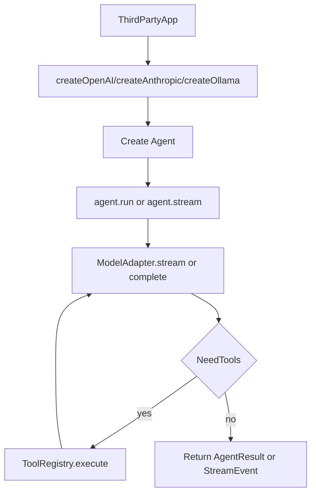

# Agent SDK 第三方集成总览

## 1. 文档目标

本文档集面向第三方开发者，提供 `agent-sdk` 的稳定公开能力说明，包括：

- 包入口与版本约束
- 核心对象和调用流程
- 公开 API 与类型参考
- 典型集成方案与排障建议

## 2. 稳定导出边界

`agent-sdk` 目前只承诺以下 3 个包入口：

- `agent-sdk`
- `agent-sdk/models`
- `agent-sdk/tools`

请勿直接依赖 `src/**` 深层路径（即使源码中存在 export），以避免后续升级破坏兼容性。

## 3. 运行环境

- Node.js >= 18
- 支持 ESM/CJS（由 `package.json` `exports` 映射到 `dist`）
- 模型提供商：
  - OpenAI
  - Anthropic
  - Ollama（本地或自部署）

## 4. 能力概览

- **Agent 执行引擎**：消息循环、工具调用、上下文压缩、会话持久化
- **多模型适配**：统一 `ModelAdapter` 接口
- **工具系统**：内置工具 + 自定义工具（Zod 参数校验）；`AgentConfig.tools` 中与内置同名则**替换**该内置实现（详见 `sdk-api-reference.md`「替换内置工具」与 `sdk-integration-recipes.md` 第 3 节）
- **Streaming**：`AsyncIterable<StreamEvent>` 实时消费
- **MCP**：stdio/http server 接入并自动映射为工具
- **Skills**：`SKILL.md` 指导能力加载与调用
- **Memory**：从 `CLAUDE.md` 注入长期上下文

## 5. 推荐阅读顺序

1. `sdk-quickstart.md`（先跑通）
2. `sdk-api-reference.md`（查函数和类）
3. `sdk-types-reference.md`（查类型定义）
4. `sdk-integration-recipes.md`（查专题实践）
5. `sdk-troubleshooting.md`（排障）
6. `sdk-examples-index.md`（对照仓库示例）

## 6. 核心调用流程

## 7. 兼容性与升级建议

- 推荐固定大版本，并在升级时重点检查：
  - `package.json` `exports` 是否变化
  - `StreamEvent` 联合类型是否新增事件
  - 模型默认值是否调整（例如默认模型名）
- 若你在生产系统接入，建议：
  - 显式传入模型与关键配置，不依赖默认值
  - 对 `tool_error` / `error` 事件做完整日志记录

