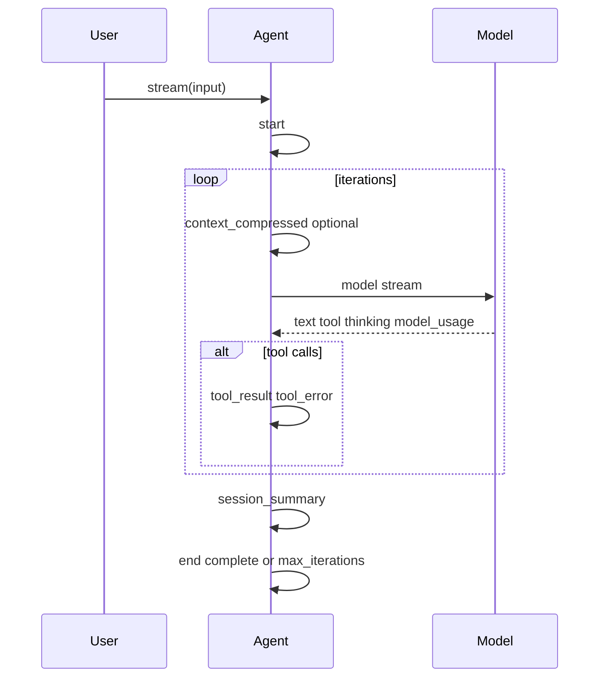

# Agent SDK 类型定义参考

本页聚焦第三方集成最常用、最关键的公开类型。与 [`sdk-api-reference.md`](./sdk-api-reference.md) 的分工：**API 参考列稳定导出与职责，本页补充类型语义与字段说明**。根包 `export * from './core/types.js'` 等**未在本文逐一枚举**；完整字段以源码与 IDE 为准。

## 1. Agent 相关

### `AgentConfig`

构造 `Agent` 时的配置。下表为**分组摘要**；工具权限、同名替换、与 `disallowedTools`/`exclusiveTools` 的关系以 [`sdk-api-reference.md`](./sdk-api-reference.md)「`AgentConfig` 工具与权限相关字段」与「**替换内置工具**」为准。

| 分组 | 字段 |
|------|------|
| 必选 | `model` |
| 系统与生成 | `systemPrompt`、`temperature`、`maxTokens`、`streaming`、`maxIterations`、`sessionId` |
| 工具与权限 | `tools`、`allowedTools`、`disallowedTools`、`canUseTool`、`exclusiveTools` |
| 交互 | `askUserQuestion` |
| Skills / MCP / Memory | `skills`、`skillConfig`、`mcpServers`、`memory`、`memoryConfig` |
| 会话与路径 | `storage`、`userBasePath`、`cwd` |
| 上下文与环境 | `contextManagement`、`includeEnvironment` |
| 可观测 | `callbacks`、`logger`、`logLevel`、`redaction` |
| Hook | `hookManager`、`hookConfigDir`、`loadHookSettingsFromFiles` |
| 子 Agent | `subagent`（`enabled`、`maxDepth`、`maxParallel`、`timeoutMs`、`allowDangerousTools`、`defaultAllowedTools`、`subagentTypePrompts`） |

未显式设置时，SDK 会合并默认 **`maxIterations: 400`**、**`streaming: true`**（可被传入配置覆盖）；常量 **`DEFAULT_MAX_ITERATIONS`** 可从包根导出。

### `AgentCallbacks` / `AgentLifecycleCallbacks`

- **`callbacks.onEvent`**：与 `Agent.stream()` 产出的每个 `StreamEvent` 同步（含 `start` / `text_delta` / `tool_result` / `end` 等）。
- **`callbacks.lifecycle.onModelEvent`**：仅模型适配器侧子集（见源码 `MODEL_STREAM_EVENT_TYPES` / `isModelStreamEventType`）。**与 `onEvent` 的关系**：模型来源的事件会进入 `onEvent`，其中子集会再进入 `onModelEvent`，二者可能重复；通常只需订阅 **`onEvent`（全量）** 或 **`lifecycle`（结构化）** 之一，或自行按 `event.type` 去重。
- **`callbacks.lifecycle`**：结构化观察点（会话、消息装配、模型请求、工具执行、落盘等），**仅通知、不改变执行结果**。拦截工具调用请使用 `hookManager` / `hookConfigDir` / `loadHookSettingsFromFiles`（见 [`tool-hook-mechanism.md`](./tool-hook-mechanism.md)）。
- **`callbacks.lifecycle.hooks`**：由 `Agent` 注入到 `ToolRegistry`，用于观察 Hook 管道（`onHookStart` / `onHookDecision` 等），不替代 `HookManager`。
- **`onError`**：可选第二参数 `AgentErrorContext`，用于区分 `run` / `model` / `tool` 等阶段。

类型定义见源码 [`src/core/callbacks.ts`](../src/core/callbacks.ts)（并由包根 `export * from './core/types.js'` 再导出常用别名）。

`CanUseToolCallback` 为根入口导出的类型别名。`AskUserQuestionResolver` 由内置交互工具随 `export *` 从 `@ddlqhd/agent-sdk` 可见（与 `createAskUserQuestionTool` 等同级）。

### `AgentResult`

```ts
interface AgentResult {
  content: string;
  toolCalls?: Array<{ name: string; arguments: unknown; result: string }>;
  usage?: TokenUsage;
  sessionId: string;
  iterations: number;
}
```

### `StreamOptions`

```ts
interface StreamOptions {
  sessionId?: string;
  systemPrompt?: SystemPrompt;
  signal?: AbortSignal;
  includeRawStreamEvents?: boolean;
}
```

## 2. 消息与内容

### `Message` / `ToolCall`

```ts
interface ToolCall {
  id: string;
  name: string;
  arguments: unknown;
}

interface Message {
  role: 'system' | 'user' | 'assistant' | 'tool';
  content: string | ContentPart[];
  toolCalls?: ToolCall[];
  toolCallId?: string;
  name?: string;
  timestamp?: number;
}
```

### `ContentPart`

```ts
type ContentPart = TextContent | ThinkingContent | ImageContent;
```

- `TextContent`: `{ type: 'text'; text: string }`
- `ThinkingContent`: `{ type: 'thinking'; thinking: string; signature?: string }`
- `ImageContent`: `{ type: 'image'; imageUrl: string; mimeType?: string }`

## 3. 模型层类型

### `ModelAdapter`

```ts
interface ModelAdapter {
  name: string;
  capabilities?: ModelCapabilities;
  stream(params: ModelParams): AsyncIterable<StreamChunk>;
  complete(params: ModelParams): Promise<CompletionResult>;
}
```

### `ModelCapabilities`

```ts
interface ModelCapabilities {
  contextLength: number;
  maxOutputTokens?: number;
}
```

- **`contextLength`**：供 SDK 内部（如上下文压缩预算）参考的上下文窗口规模（token），**不保证**与当前 `model` 字符串的真实上限一致。
- **`maxOutputTokens`**：单次补全可生成的输出 token 上限的 SDK 侧缺省；各适配器会将其映射到具体 HTTP 字段（见下）。

### 各提供商适配器的默认 `capabilities`

`createOpenAI` / `createAnthropic` / `createOllama`（及 `createModel` 构造的对应适配器）在**未**传入工厂选项中的 `capabilities` 时，共用常量 **`DEFAULT_ADAPTER_CAPABILITIES`**（由 `@ddlqhd/agent-sdk` 与 `@ddlqhd/agent-sdk/models` 导出）：`contextLength` **200000**，`maxOutputTokens` **32000**。

单次请求的最终输出上限为 `ModelParams.maxTokens ?? adapter.capabilities?.maxOutputTokens ?? DEFAULT_ADAPTER_CAPABILITIES.maxOutputTokens`（`??` 链，与源码一致）。`Agent` 在配置里设置 **`AgentConfig.maxTokens`** 时，会传入底层 `ModelParams.maxTokens`，从而**优先于**适配器默认。

各提供商在 HTTP 中的对应关系：

| 提供商 | 请求中的字段 |
|--------|----------------|
| Anthropic Messages API | `max_tokens` |
| OpenAI Chat Completions | `max_tokens` |
| Ollama `/api/chat` | `options.num_predict` |

真实模型或 API 的上限可能**低于**上述 SDK 默认；若收到与 `max_tokens` / 上下文相关的 400，请通过工厂的 `capabilities`（或更小的 `AgentConfig.maxTokens`）收窄。

### `SDKLogger` / `LogEvent`

```ts
type SDKLogLevel = 'debug' | 'info' | 'warn' | 'error' | 'silent';

interface SDKLogger {
  debug?(event: LogEvent): void;
  info?(event: LogEvent): void;
  warn?(event: LogEvent): void;
  error?(event: LogEvent): void;
}

interface LogEvent {
  source: 'agent-sdk';
  component: 'agent' | 'model' | 'streaming' | 'tooling' | 'memory';
  event: string;
  message?: string;
  provider?: string;
  model?: string;
  operation?: 'stream' | 'complete' | 'compress' | 'tool_call';
  sessionId?: string;
  iteration?: number;
  requestId?: string;
  clientRequestId?: string;
  statusCode?: number;
  durationMs?: number;
  toolName?: string;
  toolCallId?: string;
  errorName?: string;
  errorMessage?: string;
  metadata?: Record<string, unknown>;
}
```

常见事件：

- `agent.run.start` / `agent.run.end`
- `model.request.start` / `model.request.end` / `model.request.error`
- `tool.call.start` / `tool.call.end` / `tool.call.error`
- `context.compress.start` / `context.compress.end`

### `LogRedactionConfig`

```ts
interface LogRedactionConfig {
  includeBodies?: boolean;
  includeToolArguments?: boolean;
  maxBodyChars?: number;
  redactKeys?: string[];
}
```

默认策略是**只记录元信息，不记录 prompt/body 全文**。下列环境变量在运行时由 SDK 读取，用于在未在 `AgentConfig.redaction` / `AgentConfig.logLevel` 中显式指定时提供默认值（**已设置的代码配置优先**）。

| 环境变量 | 作用 | 默认 / 解析规则 |
|----------|------|-------------------|
| `AGENT_SDK_LOG_LEVEL` | 全局日志级别；与 `SDKLogLevel` 一致 | 未设置且未注入 `logger` 时等价静默；仅注入 `logger` 且未设置本变量与代码 `logLevel` 时默认为 `info`。取值：`debug` \| `info` \| `warn` \| `error` \| `silent`。 |
| `AGENT_SDK_LOG_BODIES` | 是否在日志元数据中包含脱敏后的请求体相关字段 | 默认 `false`。`1` / `true` / `yes` 为真，`0` / `false` / `no` 为假。 |
| `AGENT_SDK_LOG_INCLUDE_TOOL_ARGS` | 是否在脱敏结构中保留工具参数 | 默认 `false`。真值/假值规则同上。 |
| `AGENT_SDK_LOG_MAX_BODY_CHARS` | 单条字符串在日志中的最大保留字符数 | 默认 **4000**；须为非负有限数字，否则按默认处理。 |

另：`redactKeys` 仅能通过 `AgentConfig.redaction.redactKeys` 在代码中扩展；环境变量不提供该列表。

未传入 `AgentConfig.logger`、且有效级别非 `silent` 时，SDK 可能将日志写入 **`console`**（见 [`sdk-integration-recipes.md`](./sdk-integration-recipes.md) 第 10 节「关键约定」）。

### `ModelParams`

```ts
interface ModelParams {
  messages: Message[];
  tools?: ToolDefinition[];
  temperature?: number;
  maxTokens?: number;
  stopSequences?: string[];
  signal?: AbortSignal;
  includeRawStreamEvents?: boolean;
  /** 会话 id：`Agent` 在每次 `stream`/`complete` 调用中会自动填入当前 `SessionManager` 的会话 */
  sessionId?: string;
  logger?: SDKLogger;
  logLevel?: SDKLogLevel;
  redaction?: LogRedactionConfig;
}
```

- **`sessionId`**：`Agent` 在每轮模型请求中都会传入，便于适配器与上游 API 关联会话。OpenAI / Ollama 适配器当前不读取该字段。
- **`logger` / `logLevel` / `redaction`**：`Agent` 会在内部模型调用时自动填入，用于让 provider 请求日志与宿主应用日志系统对接。
- **Anthropic 请求 `metadata`**：在 `createAnthropic` / `AnthropicAdapter` 构造参数 `AnthropicConfig.metadata` 中设置（静态对象，或接收当次请求的 **`ModelParams`** 并返回普通对象的函数）。适配器将 `sessionId` 映射为 `user_id` 后，与解析后的 `metadata` **浅合并**（配置中的键可覆盖 `user_id`）。类型名为 `AnthropicRequestMetadata`（由 `@ddlqhd/agent-sdk/models` 导出）。详见 [Anthropic Messages `metadata`](https://docs.anthropic.com/en/api/messages)（`user_id` 须为不透明标识，勿传邮箱等 PII）。
- **Anthropic extended thinking**：在 `createAnthropic` / `AnthropicAdapter` 的 `AnthropicConfig.thinking` 中设置（或 `createModel({ provider: 'anthropic', thinking, ... })` 透传）。类型为 `AnthropicThinkingOption`：布尔时 `true` 映射为 `{ type: 'enabled', budget_tokens: 1024 }`，`false` 为 `{ type: 'disabled' }`；也可传官方对象，如 `{ type: 'enabled', budget_tokens: N }`、`{ type: 'disabled' }`、或 `adaptive` 模式。若 `adaptive` 且带 `effort`（`low` \| `medium` \| `high` \| `max`），会在请求中额外写入 `output_config.effort`。**省略** `thinking` 时不在请求体中带 `thinking`（与旧版一致）。`budget_tokens` 与模型/版本、以及是否采用 adaptive 的约束以 [Anthropic 文档](https://docs.anthropic.com/en/build-with-claude/extended-thinking) 为准。
- **Anthropic 初次 HTTP 重试**：`AnthropicConfig.fetchRetry`（类型 `AnthropicFetchRetryOptions`）。**省略**时默认 **`maxAttempts: 2`**（即失败时**自动再试 1 次**），对典型网络错误及 HTTP **429 / 502 / 503 / 504** 生效，并尊重 `Retry-After`（受 `maxDelayMs` 封顶）；**不**涵盖 SSE 已开始后的流式中断。若需严格单次请求、不重试，可设 `fetchRetry: { maxAttempts: 1 }`。

### `CompletionResult` / `TokenUsage`

```ts
interface CompletionResult {
  content: string;
  /** 扩展思考轨迹：Ollama 或 Anthropic 非流式 `complete` 的 thinking 块（若有） */
  thinking?: string;
  toolCalls?: ToolCall[];
  usage?: TokenUsage;
  metadata?: Record<string, unknown>;
}

interface TokenUsage {
  promptTokens: number;
  completionTokens: number;
  totalTokens: number;
}
```

### `SessionTokenUsage`

`Agent.getSessionUsage()` 返回的会话级累计用量（与单次 API 返回的 `TokenUsage` 字段含义不同）：

```ts
interface SessionTokenUsage {
  /** 当前上下文规模（最近一次 API 返回的 input 侧 tokens，用于压缩判断） */
  contextTokens: number;
  inputTokens: number;
  outputTokens: number;
  cacheReadTokens: number;
  cacheWriteTokens: number;
  totalTokens: number;
}
```

## 4. 工具层类型

### `ToolDefinition`

```ts
interface ToolDefinition {
  name: string;
  description: string;
  parameters: z.ZodSchema;
  handler: ToolHandler;
  isDangerous?: boolean;
  category?: string;
}
```

### `ToolResult`

```ts
interface ToolResult {
  content: string;
  isError?: boolean;
  metadata?: ToolResultMetadata;
}
```

### `ToolExecutionContext`

```ts
interface ToolExecutionContext {
  toolCallId?: string;
  projectDir?: string;
  agentDepth?: number;
}
```

## 5. Streaming 事件类型

### `StreamEvent`（联合类型概述）

`StreamEvent` 是以 `type` 为判别字段的联合类型，并与 `StreamEventAnnotations` 相交（见下）。**第三方集成应通过 `Agent.stream` 消费**。下列总表与 `StreamEventType`（源码）一致；细节见各 `###` 小节。

| `type` | 摘要 |
|--------|------|
| `start` | 本轮流开始 |
| `text_start` / `text_delta` / `text_end` | 助手文本块边界与增量 |
| `tool_call_start` / `tool_call_delta` / `tool_call_end` / `tool_call` | 工具调用流式与最终形态 |
| `tool_result` / `tool_error` | 本地执行结果或错误 |
| `thinking_start` / `thinking` / `thinking_end` | 扩展思考块边界与增量 |
| `model_usage` | 模型侧用量片段 |
| `session_summary` | 本轮累计用量与迭代数（成功路径权威用量） |
| `end` | 本轮结束（含 `reason`） |
| `context_compressed` | 上下文压缩完成 |

### 共用：`TokenUsage`

流式事件中与用量相关的字段使用与全局一致的 `TokenUsage`（亦见上文 `AgentResult` / 源码）：

```ts
interface TokenUsage {
  promptTokens: number;
  completionTokens: number;
  totalTokens: number;
}
```

- 用于 **`model_usage`** 的 `usage` 时：通常来自**当前一次模型流式响应**中适配器汇总的片段（同一轮内可出现多次；`phase` 区分输入/输出阶段时，便于对齐 Anthropic 等）。
- 用于 **`session_summary`** 的 `usage` 时：在成功路径上为**本轮 `stream` 调用累计**的权威汇总（优先于随后 `end` 上可能存在的 `usage`）。

### 共用：`StreamEventAnnotations`

下列可观测性字段由 `Agent.stream` 在发出事件前注入（UUID、迭代号、会话 id 等）：

```ts
interface StreamEventAnnotations {
  streamEventId?: string;
  iteration?: number;
  sessionId?: string;
}
```

- **`iteration`**：Agent 多轮「模型 → 工具 → 再模型」循环中的从 0 开始的序号。
- **`sessionId`**：当前会话 id；**`session_summary` 变体本身不再重复 payload 中的会话 id**，请用注解上的 `sessionId` 做关联（与源码 JSDoc 一致）。

### 事件来源（`Agent.stream`）

在 **`Agent.stream`** 下，一次运行中可能出现的事件类别包括：模型侧归一化后的文本/工具/thinking/`model_usage`；在启用上下文管理且发生压缩时的 `context_compressed`；本地执行工具后的 `tool_result` / `tool_error`；成功结束前的 `session_summary`；以及标志本轮结束的 `end`（含 `reason: 'complete' | 'aborted' | 'error' | 'max_iterations'` 等，详见下文 `end`）。**具体是否出现、顺序**取决于本轮对话是否触发工具、是否压缩上下文等。

### `start`

```ts
{ type: 'start'; timestamp: number }
```

| 字段 | 类型 | 说明 |
|------|------|------|
| `timestamp` | `number` | 开始时间戳（毫秒） |

**时机**：用户消息已写入会话后、进入 `maxIterations` 循环之前。

### `text_start`

```ts
{ type: 'text_start'; content?: string }
```

| 字段 | 类型 | 说明 |
|------|------|------|
| `content` | `string`（可选） | 可选的块前缀提示 |

**时机**：在 `Agent.stream` 中，当开启文本边界事件时，在一段助手文本的第一个 `text_delta` 之前发出，标记文本块开始（实现上由内部的 chunk 归一化管线发出；见文末「实现备注」）。

### `text_delta`

```ts
{ type: 'text_delta'; content: string }
```

| 字段 | 类型 | 说明 |
|------|------|------|
| `content` | `string` | 助手可见文本的增量片段 |

**时机**：模型文本流式输出过程中；同一文本块内可出现多次。

### `text_end`

```ts
{ type: 'text_end'; content?: string }
```

| 字段 | 类型 | 说明 |
|------|------|------|
| `content` | `string`（可选） | 可选的块收尾 |

**时机**：在 `Agent.stream` 中，当开启文本边界事件时，在离开当前文本块前发出（例如切换到工具块或该轮模型流结束）；若当前不在文本块内则可能不发出（实现备注见文末）。

### `tool_call_start`

```ts
{ type: 'tool_call_start'; id: string; name: string }
```

| 字段 | 类型 | 说明 |
|------|------|------|
| `id` | `string` | 本次工具调用 id，与后续 `tool_call_delta` / `tool_call_end` / `tool_call` 及 `tool_result` 的 `toolCallId` 对应 |
| `name` | `string` | 工具名 |

**时机**：模型开始以流式方式输出某次工具调用时（`Agent.stream` 将模型输出归一化为事件；实现备注见文末）。

### `tool_call_delta`

```ts
{ type: 'tool_call_delta'; id: string; arguments: string }
```

| 字段 | 类型 | 说明 |
|------|------|------|
| `id` | `string` | 与 `tool_call_start` 相同的调用 id |
| `arguments` | `string` | JSON 参数字符串的增量片段 |

**时机**：工具参数仍流式拼接时；可与 `tool_call_start` 交错直至参数闭合。

### `tool_call_end`

```ts
{ type: 'tool_call_end'; id: string }
```

| 字段 | 类型 | 说明 |
|------|------|------|
| `id` | `string` | 与本次流式工具调用对应的 id |

**时机**：流式参数 JSON 在模型侧闭合时发出，发生在最终 `tool_call` 之前（或与原子 `tool_call` 路径下的归一化顺序一致）。

### `tool_call`

```ts
{ type: 'tool_call'; id: string; name: string; arguments: unknown }
```

| 字段 | 类型 | 说明 |
|------|------|------|
| `id` | `string` | 工具调用 id |
| `name` | `string` | 工具名 |
| `arguments` | `unknown` | 解析后的参数对象 |

**时机**：一次工具调用的**最终**形态（非流式或流式拼接完成后）。可与 `tool_call_start` / `tool_call_delta` / `tool_call_end` 组合出现，取决于适配器与处理器路径。

### `tool_result`

```ts
{ type: 'tool_result'; toolCallId: string; result: string }
```

| 字段 | 类型 | 说明 |
|------|------|------|
| `toolCallId` | `string` | 对应模型侧一次调用的 id |
| `result` | `string` | 写入消息历史的工具结果文本；失败时内容中常含 `Error: …`，且同一调用前通常已有 `tool_error` |

**时机**：**仅 `Agent.stream`**。在本地 `executeTools` 之后**每个**调用都会发出一次（成功与失败均会）。经网络传输时需自行序列化相关负载。

### `tool_error`

```ts
{ type: 'tool_error'; toolCallId: string; error: Error }
```

| 字段 | 类型 | 说明 |
|------|------|------|
| `toolCallId` | `string` | 对应失败的工具调用 id |
| `error` | `Error` | 工具执行失败时的错误对象 |

**时机**：**仅 `Agent.stream`**。当 `executeTools` 返回 `isError` 时，在**同一调用的** `tool_result` 之前发出。经网络传输时需自行将 `Error` 序列化（例如 `message` / `stack`）。

### `thinking`

```ts
{ type: 'thinking'; content: string; signature?: string }
```

| 字段 | 类型 | 说明 |
|------|------|------|
| `content` | `string` | 扩展思考文本增量 |
| `signature` | `string`（可选） | 提供商要求的思考块签名（如 Anthropic） |

**时机**：模型流中出现 thinking 块时。

### `thinking_start`

```ts
{ type: 'thinking_start'; signature?: string }
```

| 字段 | 类型 | 说明 |
|------|------|------|
| `signature` | `string`（可选） | 提供商要求的思考块签名（如 Anthropic） |

**时机**：模型侧开始一段 thinking 块时（若适配器发出该事件）。

### `thinking_end`

```ts
{ type: 'thinking_end'; content?: string }
```

| 字段 | 类型 | 说明 |
|------|------|------|
| `content` | `string`（可选） | 块收尾可选内容 |

**时机**：离开当前 thinking 块前（若适配器发出该事件）。

### `model_usage`

```ts
{
  type: 'model_usage';
  usage: TokenUsage;
  phase?: 'input' | 'output';
}
```

| 字段 | 类型 | 说明 |
|------|------|------|
| `usage` | `TokenUsage` | 当前片段汇总的 token 统计 |
| `phase` | `'input' \| 'output'`（可选） | 部分提供商区分输入/输出阶段 |

**时机**：模型适配器将 SSE chunk 中的用量转为事件；一轮模型调用内可出现多次。Agent 用其更新内部累计用量与会话用量。

### `session_summary`

```ts
{
  type: 'session_summary';
  usage: TokenUsage;
  iterations: number;
}
```

| 字段 | 类型 | 说明 |
|------|------|------|
| `usage` | `TokenUsage` | **本轮流式运行的权威累计用量**（成功路径上应以此为准） |
| `iterations` | `number` | **本轮 `stream` 调用内已完成的模型回合数**（一次「把消息交给模型并得到回复」计为 1；触顶时为配置的上限 `maxIterations`） |

**时机**：在持久化消息成功后、最终 `end`（`reason: 'complete'` 或 **`max_iterations`**）之前发出。会话 id 见注解 `sessionId`，见上文 `StreamEventAnnotations`。

### `end`

```ts
{
  type: 'end';
  timestamp: number;
  usage?: TokenUsage;
  reason?: 'complete' | 'aborted' | 'error' | 'max_iterations';
  error?: Error;
  partialContent?: string;
}
```

| 字段 | 类型 | 说明 |
|------|------|------|
| `timestamp` | `number` | 结束时间 |
| `usage` | `TokenUsage`（可选） | 中止等路径上可能携带当前累计用量 |
| `reason` | `'complete' \| 'aborted' \| 'error' \| 'max_iterations'`（可选） | 省略或与 `complete` 视为正常结束；**`max_iterations`** 表示工具循环达到 `maxIterations` 上限 |
| `error` | `Error`（可选） | 未捕获异常或模型流致命错误 |
| `partialContent` | `string`（可选） | 用户中断时已生成的助手文本 |

**时机与注意**：

- **正常完成（`reason: 'complete'`）或触顶（`reason: 'max_iterations'`）**：累计用量以 **`session_summary`** 为准（若存在）；`end` 上通常不带 `usage`。
- **中止（`reason: 'aborted'`）**：含迭代开头 `signal` 已中止、流式中途中止、`AbortError` 等；可带 `partialContent`。
- **错误（`reason: 'error'`）**：含模型流处理出的致命错误（如 chunk 映射为 `end`+error）以及 `Agent.stream` 的 `catch`。若在进入 **`session_summary` 之前**因模型致命错误返回，则**不会**收到 `session_summary`（与成功路径不同）。

### `context_compressed`

```ts
{
  type: 'context_compressed';
  stats: {
    originalMessageCount: number;
    compressedMessageCount: number;
    durationMs: number;
  };
}
```

| 字段 | 类型 | 说明 |
|------|------|------|
| `stats` | `{ originalMessageCount; compressedMessageCount; durationMs }` | 压缩前后消息数与耗时 |

**时机**：**仅 `Agent.stream`**，且配置了上下文管理；在**某次迭代开头**需要压缩并完成后发出，提示历史已被改写。

### 典型顺序（`Agent.stream` 成功路径）



### 实现备注

各适配器将原始流归一化为 `StreamEvent`。**应用集成以 `Agent.stream` 产出为准**；内部类名（如 `StreamChunkProcessor`）不视为稳定 API。

### 与 Claude Messages API 流式形状的对照（可选）

以下对照便于从 Anthropic 文档迁移；仍以本页各 `type` 的字段为准。

| Claude API（节选） | @ddlqhd/agent-sdk `StreamEvent` |
|--------------------|-------------------------|
| `content_block_start`（text） | `text_start`（首个 `text_delta` 前） |
| `content_block_delta` / `text` | `text_delta` |
| `content_block_stop`（text） | `text_end` |
| `content_block_start`（tool_use） | `tool_call_start` |
| `content_block_delta` / `input_json_delta` | `tool_call_delta` |
| `content_block_stop`（tool_use） | `tool_call_end` 再 `tool_call` |
| 用户/工具结果轮次 | `tool_result`（及可能的 `tool_error`） |
| 会话关联 | 事件上的 `sessionId`、`streamEventId`、`iteration` |
| 历史压缩 | `context_compressed` |
| 原始 SSE 记录 | 在 `includeRawStreamEvents` 时由适配器附带原始块（见适配器文档） |

## 6. MCP 类型

### `MCPServerConfig`

```ts
interface MCPServerConfig {
  name: string;
  transport: 'stdio' | 'http';
  command?: string;
  args?: string[];
  env?: Record<string, string>;
  cwd?: string;
  url?: string;
  headers?: Record<string, string>;
}
```

stdio 的 `cwd` 若未设置或仅空白：`Agent.connectMCP` 会填入 `AgentConfig.cwd`（若也未配置则为 `process.cwd()`）；直接使用 `MCPClient` 且未设置时不向 spawn 传 `cwd`，子进程继承父进程工作目录。

### MCP 工具注册名（Agent 对外）

接入 Agent 后，MCP 工具在 `ToolRegistry` / 模型可见列表中的名称为 **`mcp__<serverName>__<toolName>`**。若 `serverName` 或 `toolName` 段内包含子串 `__`，按段解析可能产生歧义，建议避免。生成与校验可使用根包导出的 `formatMcpToolName` / `isMcpPrefixedToolName`（见 [`sdk-api-reference.md`](./sdk-api-reference.md)「MCP」）。

### `MCPConfigFile`

```ts
interface MCPConfigFile {
  mcpServers: {
    [name: string]: {
      command?: string;
      args?: string[];
      env?: Record<string, string>;
      cwd?: string;
      url?: string;
      headers?: Record<string, string>;
    };
  };
}
```

## 7. Skills 与 Memory 类型

### `SkillMetadata` / `SkillDefinition`

```ts
interface SkillMetadata {
  name: string;
  description: string;
  version?: string;
  author?: string;
  dependencies?: string[];
  tags?: string[];
  argumentHint?: string;
  disableModelInvocation?: boolean;
  userInvocable?: boolean;
}

interface SkillDefinition {
  metadata: SkillMetadata;
  path: string;
  instructions: string;
}
```

### `MemoryConfig` / `SkillConfig`

```ts
interface MemoryConfig {
  workspacePath?: string;
}

interface SkillConfig {
  autoLoad?: boolean;
  workspacePath?: string;
  additionalPaths?: string[];
}
```

## 8. 存储类型

### `StorageConfig` / `StorageAdapter` / `SessionInfo`

```ts
interface StorageConfig {
  type: 'jsonl' | 'memory';
}

interface StorageAdapter {
  save(sessionId: string, messages: Message[]): Promise<void>;
  load(sessionId: string): Promise<Message[]>;
  list(): Promise<SessionInfo[]>;
  delete(sessionId: string): Promise<void>;
  exists(sessionId: string): Promise<boolean>;
}
```

`SessionInfo`:

```ts
interface SessionInfo {
  id: string;
  createdAt: number;
  updatedAt: number;
  messageCount: number;
  metadata?: Record<string, unknown>;
}
```

## 9. CLI 类型（已公开，但偏 CLI 语义）

根入口也导出了：

- `CLIConfig`
- `ChatOptions`
- `RunOptions`
- `ToolListOptions`
- `SessionListOptions`
- `MCPOptions`
- `SkillOptions`

这些类型主要用于 CLI 集成，不建议在纯业务 SDK 接口层强耦合。

